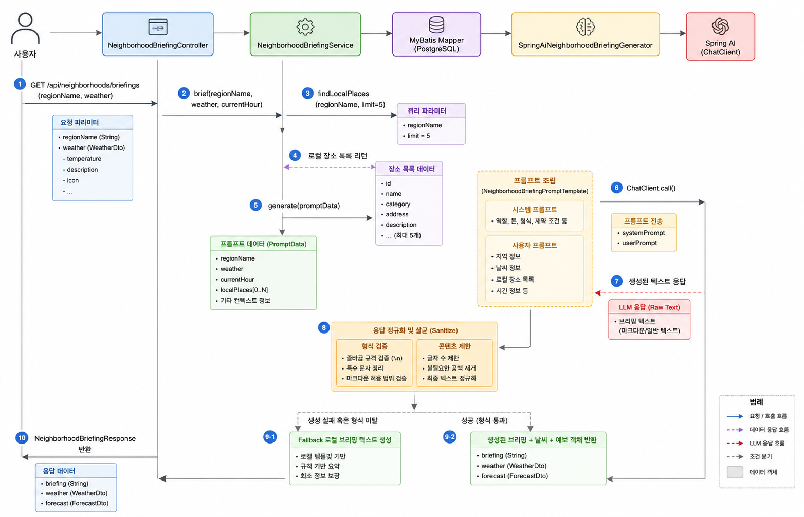
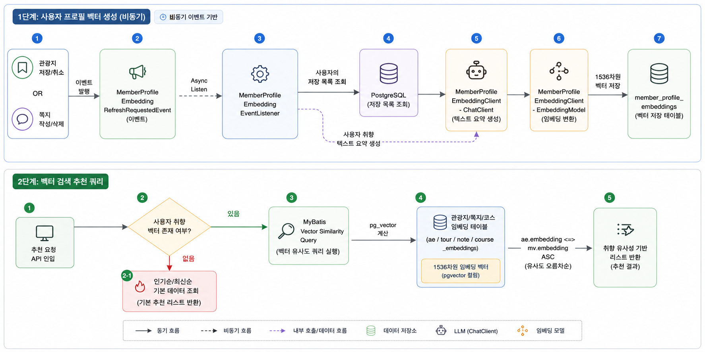
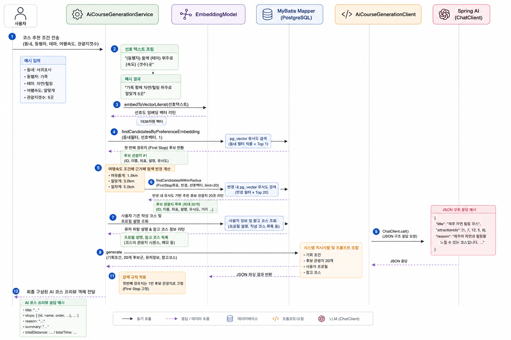

# EnjoyTrip AI 기능 구현 및 흐름 설계서

본 문서는 프로젝트에서 제공하는 **AI 브리핑(AI Briefing)**, **AI 추천(AI Recommendation)**, **AI 코스 생성 및 최적화(AI Course Generation & Optimization)** 기능의 아키텍처, 데이터 흐름, 핵심 클래스 및 프롬프트 구조를 정리한 문서입니다.

---

## 1. 공통 AI 기술 스택 & 아키텍처

우리 프로젝트는 다음과 같은 기술 조합으로 하이브리드 AI 검색 및 생성 시스템을 구성하고 있습니다.
*   **LLM & Embedding 클라이언트**: Spring AI 프레임워크 (`ChatClient`, `EmbeddingModel`) 및 GMS API(OpenAI/Gemini 기반 커스텀 게이트웨이) 연동
*   **벡터 검색 데이터베이스**: PostgreSQL의 `pg_vector` 익스텐션 활성화 및 MyBatis 매퍼 연동
*   **유사도 측정**: 코사인 거리 연산자 `<=>`를 사용하여 다차원 임베딩 벡터 간 유사성 검색 수행
*   **멀티 모듈 구조**:
    *   `core-api`: HTTP 컨트롤러, 이벤트 리스너, 도메인 비즈니스 서비스 레이어 담당
    *   `storage:db-core`: MyBatis Mapper 인터페이스/XML 쿼리 및 DB 엔티티 보관
    *   `external`: 외부 LLM/임베딩 API 게이트웨이와 통신 처리 (의존 관계 고립)
    *   `batch`: 백필 배치 작업이나 단독 키워드 의미 확장 게이트웨이 보관

---

## 2. AI 브리핑 (AI Briefing)

### 개요
사용자가 홈 화면에 진입할 때, 사용자가 위치한 동네(지역)의 매력과 날씨 정보, 그리고 인근의 로컬 장소를 조합하여 **대화체(해요체)로 친근하게 요약 코스 및 활동 팁**을 제공하는 기능입니다.

### 데이터 흐름도

### 프롬프트 엔지니어링 전략
구현: `NeighborhoodBriefingPromptTemplate` (System/User 분리), `SpringAiNeighborhoodBriefingGenerator` (호출), `NeighborhoodBriefingService` (폴백)

*   **Role Prompting (역할 부여)**: System prompt에서 '곳곳' 홈 카피라이터 persona를 고정해 톤·책임 범위를 먼저 정의
*   **Inline Few-shot (줄별 인라인 예시)**: 네 줄 규칙마다 `(예: "...")` 형태의 good example을 System prompt에 포함 — 줄별 one-shot으로 출력 형식·말투를 유도
*   **Negative Prompting (금지 패턴 명시)**: 기계적 단답형, JSON/Markdown/bullet, 특수기호, 목록에 없는 장소 생성 등 **하지 말아야 할 출력**을 명시적으로 차단
*   **Dual Prompt Pattern (System/User 분리)**: System = 불변 규칙·예시, User = 지역·날씨·DB 장소 목록 등 **요청마다 바뀌는 컨텍스트**만 주입
*   **Context Grounding (근거 기반 생성)**: `findLocalPlaces(limit=5)` 결과만 User prompt에 넣어 hallucination을 줄이고, 장소 목록이 비면 장소 언급 없이 분위기·활동만 추천하도록 조건 분기
*   **Instruction Echoing (지시 반복)**: User prompt 끝에서 4줄 구조·해요체·30~45자/줄·150자 내외 제한을 다시 한 번 강조해 System 규칙 이탈을 완화
*   **Output Sanitization (후처리 검증)**: LLM 응답에 `sanitize()`를 적용해 코드블록·구조화 마커·bullet·내부 키워드(`courseId` 등)를 제거하고 max length로 절단
*   **Graceful Degradation (폴백)**: 생성 실패·형식 이탈·빈 응답 시 로컬 템플릿 브리핑으로 전환하고 `@Cacheable`로 동일 지역·시간대 재호출 비용 절감

---

## 3. AI 추천 (AI Recommendation)

### 개요
사용자의 개인화된 여행 취향(Saved Attractions 및 Saved Notes 기록)을 텍스트 요약 후 임베딩 처리하여 데이터베이스에 저장한 뒤, **관광지(Attractions), 쪽지(Notes), 코스(Courses)와 사용자의 취향 벡터 간 코사인 거리를 계산하여 실시간 취향 저격 추천**을 해주는 기능입니다.

### 클래스 매핑
*   **이벤트 리스너**: [MemberProfileEmbeddingEventListener.java](file:///Users/hj.park/projects/local-enjoy-trip-backend/core/core-api/src/main/java/com/ssafy/enjoytrip/core/domain/event/listener/MemberProfileEmbeddingEventListener.java)
*   **임베딩 클라이언트**: [MemberProfileEmbeddingClient.java](file:///Users/hj.park/projects/local-enjoy-trip-backend/external/src/main/java/com/ssafy/enjoytrip/external/profile/MemberProfileEmbeddingClient.java)
*   **각 도메인 서비스**:
    *   관광지: [AttractionService.java](file:///Users/hj.park/projects/local-enjoy-trip-backend/core/core-api/src/main/java/com/ssafy/enjoytrip/core/domain/service/AttractionService.java)
    *   쪽지: [NoteService.java](file:///Users/hj.park/projects/local-enjoy-trip-backend/core/core-api/src/main/java/com/ssafy/enjoytrip/core/domain/service/NoteService.java)
    *   코스: [CourseService.java](file:///Users/hj.park/projects/local-enjoy-trip-backend/core/core-api/src/main/java/com/ssafy/enjoytrip/core/domain/service/CourseService.java)
*   **벡터 매퍼 XML**:
    *   [AttractionMapper.xml](file:///Users/hj.park/projects/local-enjoy-trip-backend/storage/db-core/src/main/resources/mybatis/mapper/AttractionMapper.xml) (`findCandidatesByMemberProfile`)
    *   [NoteMapper.xml](file:///Users/hj.park/projects/local-enjoy-trip-backend/storage/db-core/src/main/resources/mybatis/mapper/NoteMapper.xml) (`findCandidatesByMemberProfile`)
    *   [CourseMapper.xml](file:///Users/hj.park/projects/local-enjoy-trip-backend/storage/db-core/src/main/resources/mybatis/mapper/CourseMapper.xml) (`findCandidatesByMemberProfile`)

### 전체 벡터 파이프라인 흐름도

### 도메인별 벡터 저장 흐름 (비동기 및 배치)
1.  **사용자 프로필**: 저장 활동(Save/Unsave) 및 쪽지 작성이 일어날 때 이벤트를 비동기로 수신(`@Async AFTER_COMMIT`), `ChatClient`로 취향 요약 후 `EmbeddingModel`로 벡터화하여 `member_profile_embeddings` 테이블에 누적합니다.
2.  **쪽지 (Notes)**: 쪽지 생성/수정 시 `NoteEmbeddingRequestedEvent`를 발행하여 본문 내용을 1536차원 벡터로 변환 후 `note_embeddings`에 저장합니다.
3.  **코스 (Courses)**: `CourseEmbeddingScheduler` 스케줄러가 주기적으로 변경 내용이 감지된(Pending) 코스를 배치 청크단위로 가져온 뒤, `CourseEmbeddingProcessor`가 코스 설명 및 경유지 정보를 요약하여 벡터화 후 `course_embeddings`에 저장합니다.
4.  **관광지 (Attractions)**: `AttractionEmbeddingBackfillService`를 통해 TourAPI 데이터를 기반으로 GPT AI의 키워드/경험 의미 확장(`GmsAttractionKeywordExpansionGateway`) 작업을 거친 뒤, 최종 확장된 문구들을 임베딩하여 `attraction_embeddings`에 저장해 둡니다.

---

## 4. AI 코스 생성 및 최적화 (AI Course Gen & Order Optimization)

이 파트는 두 가지 다른 흐름의 AI 기술이 유기적으로 연결되어 동작합니다.
1.  **AI 코스 생성**: 사용자 맞춤 주제 및 제약사항을 바탕으로 공간 벡터 유사도를 통해 후보군을 추리고, LLM이 코스를 자동 기획합니다.
2.  **코스 순서 최적화**: 임의의 순서로 구성된 코스 내 장소들을 지리적 인접도와 시간 및 식사 시간대를 고려하여 최적의 이동 순서로 재배열(Traveling Salesperson Problem의 AI 접근)합니다.

### 4.1 AI 코스 생성 (AI Course Generation)

#### 상세 처리 흐름

#### 프롬프트 엔지니어링 전략
구현: `AiCourseGenerationClient` (프롬프트·파싱), `AiCourseGenerationService` (후보 검색·첫 경유지 강제)

*   **Role Prompting + Structured Output**: 전문가 persona와 함께 `{"title","attractionIds","reason","tags"}` JSON 스키마를 System prompt에 고정
*   **Few-shot Examples (필드별 예시)**: `title`, `tags` 규칙마다 good example을 System prompt에 포함해 자연스러운 한국어 제목·해시태그 형식을 유도
*   **Negative Prompting**: 제목에 장소 수·속도·지역 코드·괄호 부가설명 금지, `#` 기호 금지 등 **원치 않는 패턴**을 명시
*   **Grounded Selection (후보군 제한)**: User prompt의 `[후보 관광지 목록]` ID 범위 밖 선택 금지 — RAG로 좁힌 20곳 안에서만 LLM이 기획
*   **Sectioned User Prompt (구조화 입력)**: `[요청 조건]` / `[후보 관광지 목록]` / `[참고 코스]` / `[유저 취향 설명]` / `[특별 지시사항]` 섹션으로 컨텍스트를 분리해 LLM이 조건·근거·제약을 구분해 읽도록 설계
*   **Reference-based Prompting**: 유사 코스·유저 프로필 설명을 선택적으로 주입해 few-shot에 가까운 **스타일·취향 참조** 제공
*   **Hard Constraint Injection**: 첫 경유지를 후보 1번으로 고정하는 `[특별 지시사항]`을 User prompt에 명시하고, 서비스 레이어에서도 동일 규칙을 재적용
*   **Post-parse Validation**: Jackson으로 strict JSON 파싱·필드 타입 검증 후 malformed 응답은 예외 처리

---

### 4.2 코스 순서 최적화 (AI Course Order Optimization)

#### 상세 처리 흐름
1.  **유효성 검사**: 최적화 대상 코스가 2개 이상의 경유지를 가졌는지, 경유지의 위경도 좌표가 완전한지 검증합니다.
2.  **데이터 바인딩**: 현재 출발 위치가 제공된다면 시작점으로 주입하고, 최적화할 장소들의 고유 ID, 위경도 좌표, 명칭, 콘텐츠 타입을 리스트 형태로 빌드합니다.
3.  **LLM 최적화 요청**: `SpringAiCourseOrderRecommendationClient.recommend`를 호출하여 최적 순서 재배치를 연산합니다.
4.  **검증 및 폴백 (Fallback)**: AI 엔진 오류·네트워크 실패·ID 누락/중복 등 응답 검증 실패 시 **위경도 삼각계산 기반 휴리스틱 최적화기(`CoordinateRouteOrderOptimizer`)**로 즉시 전환합니다.

#### 프롬프트 엔지니어링 전략
구현: `SpringAiCourseOrderRecommendationClient`

*   **Priority-ordered Constraints**: System prompt에서 최적화 목표를 1~8번 **우선순위 목록**으로 정의해 충돌 시 판단 기준을 고정
*   **Structured JSON Output**: `{"orderedItemIds":[...]}` 단일 필드만 허용 — 설명·래핑·추가 필드 금지
*   **Do-not-invent Rule**: 영업시간은 제공된 경우만 반영하고, 없으면 추측하지 않도록 User prompt에 `Opening hours: not provided` 명시
*   **Structured User Context**: 위경도·현재 위치·식사 윈도우·아이템 메타데이터를 key-value 형태로 주입해 reasoning 근거를 코드와 프롬프트 양쪽에서 공유
*   **English System Prompt**: 기하·거리·제약 reasoning은 영어 System prompt로 작성해 모델의 구조적 추론 안정성을 확보
*   **Post-parse Validation**: Jackson strict JSON 파싱으로 ID 집합 무결성 검증 — 실패 시 서비스 레벨 휴리스틱 폴백으로 연결

---
*작성일: 2026년 06월 26일*
*프로젝트: Local Enjoy Trip Backend*
