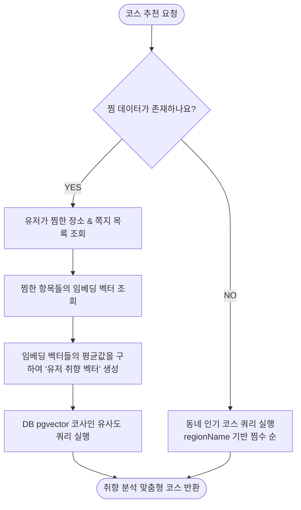

# [Plan] 코스 MD 구분 제거 및 찜 기반 취향 분석 코스 추천 기능 설계

본 문서는 비즈니스 요구사항 변경에 따라 코스의 MD(어드민 추천) 구분을 제거하고, 유저가 찜한 장소 및 쪽지 데이터를 기반으로 취향을 분석하여 맞춤형 코스를 추천하는 시스템의 설계 및 실행 계획을 정의합니다. 

> [!NOTE]
> 해당 API는 인증이 완료된 로그인 유저만 접근 가능함을 전제로 설계합니다. 비로그인/비회원 상태에 대한 예외 처리는 고려하지 않습니다.

---

## 1. 배경 및 목적
* **MD 구분 제거**: 
  * 기존에는 관리자(`ADMIN` 역할)가 작성한 코스를 MD 코스로 우대하여 정렬 및 별도 픽업을 수행했습니다.
  * 변경된 요구사항에 따라 관리자가 만든 코스와 유저가 만든 코스를 완전히 동일하게 취급하도록 단순화합니다.
* **찜 데이터 기반 개인화 코스 추천**:
  * 로그인한 유저가 찜한 장소(`attraction_favorites`)와 쪽지(`note_saves`)의 내용을 분석하여 유저 취향 벡터를 생성합니다.
  * 취향 벡터와 코스 내부 아이템(장소/쪽지)들의 임베딩 벡터 간 pgvector 기반 코사인 유사도(Cosine Similarity)를 연산하여 맞춤형 코스를 추천합니다.
* **행동 데이터 부재 시 폴백(Fallback)**:
  * 찜 데이터(행동 이력)가 전혀 없는 유저의 경우, 입력받은 동네(지역명, `regionName`) 내에서 찜(`course_saves`) 수가 가장 높은 인기 코스를 노출합니다.

---

## 2. 시스템 아키텍처 및 데이터 흐름

### 2.1 데이터 모델 설계

#### 1) 쪽지 임베딩 테이블 추가 (`note_embeddings`)
쪽지의 임베딩 정보가 저장되어 있어야 DB 조인을 통해 고속으로 유사 코스를 추천할 수 있습니다. 이를 위해 `note_embeddings` 테이블을 신설합니다.

```sql
-- V2__create_note_embeddings.sql (Flyway Migration)
CREATE TABLE note_embeddings (
    id BIGINT GENERATED BY DEFAULT AS IDENTITY,
    note_id BIGINT NOT NULL,
    embedding vector(3072),
    embedding_input TEXT,
    source_version VARCHAR(128) NOT NULL,
    source_text_hash VARCHAR(64) NOT NULL,
    embedding_dimension INTEGER NOT NULL,
    provider VARCHAR(64) NOT NULL,
    model VARCHAR(128) NOT NULL,
    status VARCHAR(20) NOT NULL,
    failure_code VARCHAR(128),
    failure_message VARCHAR(1000),
    attempt_count INTEGER NOT NULL DEFAULT 0,
    last_attempted_at TIMESTAMP(6),
    embedded_at TIMESTAMP(6),
    created_at TIMESTAMP(6) NOT NULL DEFAULT CURRENT_TIMESTAMP,
    updated_at TIMESTAMP(6) NOT NULL DEFAULT CURRENT_TIMESTAMP,
    PRIMARY KEY (id),
    CONSTRAINT uk_note_embeddings_note UNIQUE (note_id),
    CONSTRAINT fk_note_embeddings_note FOREIGN KEY (note_id) references notes(id) ON DELETE CASCADE,
    CONSTRAINT chk_note_embeddings_status CHECK (status IN ('PENDING', 'EMBEDDED', 'FAILED')),
    CONSTRAINT chk_note_embeddings_dimension CHECK (embedding_dimension = 3072)
);

CREATE INDEX idx_note_embeddings_status ON note_embeddings (status);
```

### 2.2 추천 알고리즘 흐름



---

## 3. 핵심 변경 사항 및 구현 계획

### 3.1 MD 구분 제거 (Simplification)

#### 1) DB Mapper 및 XML 수정 (CourseMapper.xml)
* **`courseColumns`**: `exists` 절을 이용해 `createdByAdmin`를 반환하던 동적 서브쿼리 제거.
* **피드 쿼리 단순화 (`findDistanceOrderedPublicFeed`)**: 어드민이 만든 코스를 최상위 3개까지 우선 노출하기 위해 사용하던 `md_top`과 `rest` CTE(Common Table Expression) 기반의 쿼리를 삭제하고, 일반 거리순 단일 정렬 쿼리로 대체합니다.
* **어드민 전용 쿼리 삭제**: `findAdminOwned`, `findAdminOwnedByDistance` 쿼리 제거.

#### 2) Java 도메인 및 DTO 수정
* **`CourseRecord`**: `createdByAdmin` 필드 및 Getter 제거.
* **`Course`**: `createdByAdmin` 필드 및 생성자 매개변수 제거.
* **`CourseReader`**: `findAdminCourses()`, `findMdFeed()` 메서드 제거. `toCourse` 매핑 로직에서 `createdByAdmin` 제거.
* **어드민 전용 서비스/컨트롤러 삭제**:
  * AdminCourseService.java 제거.
  * AdminCourseController.java 제거.
  * CourseController.java 내 `mdFeed` API 제거.
  * `CourseMdFeedRequest` DTO 제거.

---

### 3.2 찜 기반 취향 분석 및 추천 구현

#### 1) 쪽지 생성/수정 시 임베딩 저장 연동
* `NoteService`에 `EmbeddingModel`을 주입하고, 쪽지가 생성/수정될 때 비동기 혹은 트랜잭션 리스너를 활용해 쪽지의 `title + content`를 텍스트 임베딩하여 `note_embeddings` 테이블에 저장합니다.
* `NoteMapper`에 `note_embeddings` 저장을 위한 `insertEmbedding`, `updateEmbedding` 쿼리를 추가합니다.

#### 2) 취향 분석 및 대표 벡터 생성
* **취향 분석 로직** (`CourseService` 또는 별도 `CourseRecommendationService` 개발):
  1. 유저의 `attraction_favorites` 장소 ID 목록을 활용하여 `attraction_embeddings` 테이블의 3072차원 벡터 획득.
  2. 유저의 `note_saves` 쪽지 ID 목록을 활용하여 `note_embeddings` 테이블의 3072차원 벡터 획득.
  3. 모든 벡터를 더하여 평균(Average Vector)을 냄으로써 **3072차원의 대표 취향 벡터** $\vec{U}$ 생성.

#### 3) pgvector 기반 코사인 유사도 매퍼 구현
`CourseMapper.xml`에 유저 취향 벡터를 기반으로 코스를 추천하는 쿼리를 추가합니다.
* 코스 내 아이템(`course_items`)들 중 장소(`attraction_id`) 및 쪽지(`note_id`)의 임베딩 평균값을 코스 단위로 그룹핑하여, 입력된 취향 벡터와의 코사인 거리(`<=>`)가 최소화되는 코스를 추천합니다.

```xml
<select id="findRecommendedCourses" resultType="com.ssafy.enjoytrip.storage.db.core.model.CourseRecord">
    WITH course_item_embeddings AS (
        SELECT ci.course_id,
               COALESCE(ae.embedding, ne.embedding) as embedding
        FROM course_items ci
        LEFT JOIN attraction_embeddings ae ON ci.attraction_id = ae.attraction_id
        LEFT JOIN note_embeddings ne ON ci.note_id = ne.note_id
        WHERE ci.attraction_id IS NOT NULL OR ci.note_id IS NOT NULL
    ),
    course_distances AS (
        SELECT cie.course_id,
               AVG(cie.embedding <=> #{userPrefVector}::vector) as distance
        FROM course_item_embeddings cie
        GROUP BY cie.course_id
    )
    SELECT c.id, 
           c.owner_member_id as ownerMemberId,
           c.title,
           c.region_name as regionName,
           c.date,
           (
               SELECT count(*)
               FROM course_saves s
               WHERE s.course_id = c.id
           ) as saveCount,
           c.created_at as createdAt,
           c.updated_at as updatedAt,
           c.deleted_at as deletedAt
    FROM courses c
    JOIN course_distances cd ON c.id = cd.course_id
    WHERE c.deleted_at IS NULL
      AND c.visibility = 'PUBLIC'
      AND c.status = 'READY'
    ORDER BY cd.distance ASC, c.id ASC
    LIMIT #{limit}
</select>
```

#### 4) 폴백 쿼리 연동 (행동이 없는 경우)
* 입력 파라미터로 제공된 `regionName`이 존재한다면, 기존의 `findByRegionOrderedBySaveCount` 쿼리를 호출하여 찜이 가장 많은 동네 인기 코스를 추천합니다.

---

## 4. API 명세 설계

### 4.1 코스 맞춤 추천 API
* **Endpoint**: `GET /api/courses/recommendations`
* **Request Query Params**:
  * `regionName` (String, 필수) - 폴백 시 및 동네 필터링 기준
  * `limit` (Integer, 선택, 기본값 10)
* **Header**: `Authorization: Bearer <Token>` (인증된 유저 정보 획득을 위해 필수)

**Response (HTTP 200 SUCCESS)**
```json
{
  "status": "SUCCESS",
  "message": null,
  "data": {
    "courses": [
      {
        "id": "course-1234",
        "title": "강남역 주변 힐링 투어",
        "regionName": "역삼동",
        "ownerMemberId": 99,
        "saveCount": 42,
        "createdAt": "2026-06-24T12:00:00",
        "updatedAt": "2026-06-24T13:00:00",
        "stops": [
          {
            "id": 1,
            "position": 1,
            "title": "블루보틀 강남",
            "distanceToNext": 120,
            "durationToNext": 3
          }
        ],
        "tags": [
          { "tagId": 1, "tagName": "힐링" }
        ]
      }
    ]
  }
}
```

---

## 5. 검증 계획 및 태스크 일정

### 5.1 로컬 검증 태스크
1. **마이그레이션 적용 및 빌드**: `./gradlew flywayMigrate` 실행 후 로컬 Docker DB 스키마 정상 적용 검증.
2. **단위 테스트**: 
   * `CourseService` 내 취향 분석 및 취향 벡터 계산 로직 단위 테스트 수행.
   * `CourseMapper` pgvector 유사도 쿼리 작동 검증 (`Storage` 모듈 컨테이너 테스트 활용).
3. **통합 테스트**: 
   * `GET /api/courses/recommendations` 엔드포인트 연계 테스트 (유저 행동 존재 시 / 미존재 시 분기 검증).
   * `./gradlew check`를 수행하여 리팩토링으로 인한 기존 빌드 파손이 없는지 전체 유효성 검증.
