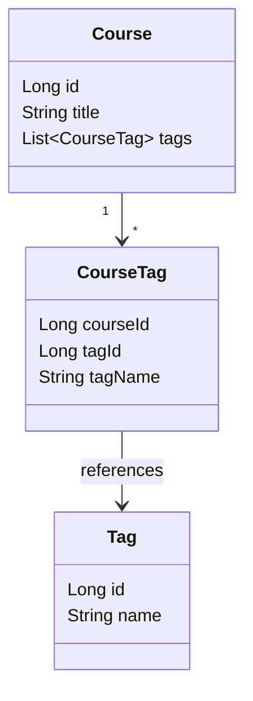

# 태그 도메인 재설계 및 공통 Value Object(VO) 도입 계획

이 계획서는 태그 구조를 재설계(관광지 태그 제거 및 코스 태그 도입)하고, 여러 도메인에서 공통으로 사용되는 주소, 좌표 및 기타 개념을 값 객체(Value Object, VO)로 묶어 재사용 가능하게 설계하기 위한 실행 계획이다.

---

## 1. 목표와 비목표

### 목표
1. **태그 개념의 재설계**
   - 기존의 `AttractionTag`를 제거하고, 태그 자체를 독립적인 개념(`Tag`)으로 분리한다.
   - 코스에 태그를 지정할 수 있도록 `CourseTag` 관계를 신설하고, 코스 피드 및 상세 조회와 연결짓는다.
2. **공통 VO(Value Object) 추출 및 확장**
   - 단일 데이터 필드로 파편화되어 있던 개념들을 비즈니스 중심의 값 객체(VO)로 응집하여 재사용한다.
   - 추출 대상 VO:
     - `Coordinate`: 위도/경도 좌표 정보
     - `Address`: 기본 주소, 상세 주소, 우편번호 정보
     - `DateRange`: 시작일 및 종료일 기간 정보
     - `RatingStats`: 평점 평균 및 평가 개수 통계 정보
     - `TemperatureRange`: 최저 기온 및 최고 기온 범위 정보
3. **단일 검증 책임(Single Validation Responsibility)**
   - **중복 검증 방지**: 도메인 VO 내부에서는 중복으로 범위 및 유효성 검증을 수행하여 비즈니스 예외를 던지지 않는다.
   - 유효성 검증은 HTTP 요청 진입점인 Web Layer(Controller, DTO Validation 등) 및 Ingress 수준에서 처리하는 것을 단일 책임 원칙으로 삼는다.
   - 도메인 VO는 검증이 완료된 신뢰할 수 있는 데이터를 구조화하여 보관하고 재사용하는 순수한 데이터 홀더(Data Holder) 및 비즈니스 연산 메서드(예: 거리 계산 등)만 포함한다.

### 비목표
- 태그 검색 성능 고도화를 위한 검색 엔진(예: Elasticsearch) 도입은 고려하지 않는다. (RDB 관계 및 인덱스 활용)
- 기존 데이터 스펙을 파괴하는 파격적 스키마 변형은 피하며, DB 테이블의 개별 컬럼 구조를 도메인 모델 VO와 매핑하는 형태로 이관한다.

---

## 2. 태그 도메인 재설계 (AttractionTag ➔ CourseTag)

현재 `AttractionTag` 구조는 관광지 도메인에 종속되어 있어 코스나 타 도메인에 적용하기 어렵다. 또한 제품 요구사항상 관광지 태그보다 **코스 중심의 태그 활용(`CourseTag`)**이 중요하므로 구조를 개편한다.

### 2.1 개념 모델



- **`Tag`**: 시스템에 존재하는 고유한 태그 명칭과 식별자.
- **`CourseTag`**: 특정 코스와 태그 간의 관계를 맺는 매핑 모델.
- **`Attraction` 관련 태그**: 기존 `AttractionTag` 클래스 및 매핑 테이블은 모두 삭제한다.

### 2.2 DB 및 스키마 변경 계획
기존 `attraction_tags` 매핑 테이블을 제거하고, `course_tags` 테이블을 신설한다.

#### 1) 신규 스키마 및 마이그레이션 (`V{Number}__add_course_tag_and_remove_attraction_tag.sql`)
```sql
-- 1. 코스 태그 매핑 테이블 신설
CREATE TABLE course_tags (
    course_id bigint NOT NULL,
    tag_id bigint NOT NULL,
    created_at timestamp without time zone DEFAULT CURRENT_TIMESTAMP,
    CONSTRAINT pk_course_tags PRIMARY KEY (course_id, tag_id),
    CONSTRAINT fk_course_tags_course FOREIGN KEY (course_id) REFERENCES courses (id) ON DELETE CASCADE,
    CONSTRAINT fk_course_tags_tag FOREIGN KEY (tag_id) REFERENCES tags (id) ON DELETE CASCADE
);

-- 2. 기존 attraction_tags 테이블 제거 (더 이상 사용하지 않음)
DROP TABLE IF EXISTS attraction_tags;
```

---

## 3. 공통 VO(Value Object) 도입 상세

도메인 내 파편화된 필드들을 VO로 응집한다. 중복 유효성 검증을 피하기 위해 **생성자 내 범위/포맷 검증 코드는 제외**한다.

### 3.1 VO 정의 목록

#### 1) `Coordinate` (좌표)
- **역할**: 위도(Latitude)와 경도(Longitude) 정보를 소유하며, 두 좌표 간 거리 계산 같은 비즈니스 편의 메서드를 가질 수 있다.
- **적용 도메인**: `Course`, `Attraction`, `Note`, `Hotplace`, `MapCenter`, `Point`
- **클래스 정의**:
  ```java
  package com.ssafy.enjoytrip.core.domain.vo;
  
  public record Coordinate(double latitude, double longitude) {
      private static final double EARTH_RADIUS_KM = 6371.0;
  
      // 거리 계산 등 비즈니스 편의 메서드를 VO 내부에 정의하여 재사용
      public double distanceKmTo(Coordinate other) {
          double dLat = Math.toRadians(other.latitude - this.latitude);
          double dLng = Math.toRadians(other.longitude - this.longitude);
          double thisLat = Math.toRadians(this.latitude);
          double otherLat = Math.toRadians(other.latitude);
  
          double haversine = Math.sin(dLat / 2.0) * Math.sin(dLat / 2.0)
                  + Math.cos(thisLat) * Math.cos(otherLat) * Math.sin(dLng / 2.0) * Math.sin(dLng / 2.0);
          return EARTH_RADIUS_KM * (2.0 * Math.atan2(Math.sqrt(haversine), Math.sqrt(1.0 - haversine)));
      }
  }
  ```

#### 2) `Address` (주소)
- **역할**: 기본 주소, 상세 주소, 우편번호 정보를 응집하여 다룬다.
- **적용 도메인**: `Attraction`, `ChargerItemRecord`
- **클래스 정의**:
  ```java
  package com.ssafy.enjoytrip.core.domain.vo;
  
  public record Address(
      String address,
      String addressDetail,
      String zipcode
  ) {
      public Address {
          address = address == null ? "" : address.trim();
          addressDetail = addressDetail == null ? "" : addressDetail.trim();
          zipcode = zipcode == null ? "" : zipcode.trim();
      }
  }
  ```

#### 3) `DateRange` (날짜 기간)
- **역할**: 비즈니스 일정의 시작일과 종료일 날짜 정보를 소유한다.
- **적용 도메인**: `TravelPlan` (startDate, endDate)
- **클래스 정의**:
  ```java
  package com.ssafy.enjoytrip.core.domain.vo;
  
  public record DateRange(
      String startDate,
      String endDate
  ) {
  }
  ```

#### 4) `RatingStats` (평점 통계)
- **역할**: 도메인 엔티티에 대한 누적 평점 평균과 평가 횟수를 관리한다.
- **적용 도메인**: `Attraction` (ratingAverage, ratingCount)
- **클래스 정의**:
  ```java
  package com.ssafy.enjoytrip.core.domain.vo;
  
  public record RatingStats(
      double ratingAverage,
      int ratingCount
  ) {
  }
  ```

#### 5) `TemperatureRange` (기온 범위)
- **역할**: 날씨 예보 등에서 최저 기온과 최고 기온 정보를 쌍으로 관리한다.
- **적용 도메인**: `WeatherSummary` (tempMin, tempMax)
- **클래스 정의**:
  ```java
  package com.ssafy.enjoytrip.core.domain.vo;
  
  public record TemperatureRange(
      Integer tempMin,
      Integer tempMax
  ) {
  }
  ```

---

## 4. 도메인 모델 및 저장소(MyBatis) 매핑 적용

### 4.1 도메인 모델 리팩토링 예시

#### 1) `Course`
- `startLatitude`, `startLongitude` ➔ `Coordinate startLocation`

#### 2) `Attraction`
- `latitude`, `longitude` ➔ `Coordinate location`
- `address`, `addressDetail`, `zipcode` ➔ `Address address`
- `ratingAverage`, `ratingCount` ➔ `RatingStats ratingStats`

#### 3) `TravelPlan`
- `startDate`, `endDate` ➔ `DateRange planPeriod`

#### 4) `WeatherSummary`
- `tempMin`, `tempMax` ➔ `TemperatureRange temperatureRange`

### 4.2 MyBatis Mapper XML 매핑 전략

MyBatis XML의 `<resultMap>` 조립 기능을 활용하여 데이터베이스 테이블 개별 컬럼을 VO 필드로 맵핑한다.

#### 예시: `AttractionMapper.xml`
```xml
<resultMap id="AttractionResultMap" type="com.ssafy.enjoytrip.core.domain.Attraction">
    <id property="id" column="id"/>
    <result property="title" column="title"/>
    <result property="tel" column="tel"/>
    <result property="imageUrl" column="first_image"/>
    <result property="imageUrl2" column="first_image2"/>
    ...
    <!-- Address VO 조립 매핑 -->
    <association property="address" javaType="com.ssafy.enjoytrip.core.domain.vo.Address">
        <result property="address" column="addr1"/>
        <result property="addressDetail" column="addr2"/>
        <result property="zipcode" column="zipcode"/>
    </association>
    <!-- Coordinate VO 조립 매핑 -->
    <association property="location" javaType="com.ssafy.enjoytrip.core.domain.vo.Coordinate">
        <result property="latitude" column="latitude"/>
        <result property="longitude" column="longitude"/>
    </association>
    <!-- RatingStats VO 조립 매핑 -->
    <association property="ratingStats" javaType="com.ssafy.enjoytrip.core.domain.vo.RatingStats">
        <result property="ratingAverage" column="rating_average"/>
        <result property="ratingCount" column="rating_count"/>
    </association>
</resultMap>
```

---

## 5. 실행 순서 및 계획

### Phase 1. VO 추출 및 DB 이관 준비
1. 공통 패키지(`core-api` 모듈 내)에 5종의 VO 클래스 생성.
2. `course_tags` 테이블 신설 및 `attraction_tags` 테이블을 제거하는 Flyway migration 스크립트 작성 및 H2 테스트 스키마 동기화.

### Phase 2. 도메인 및 Mapper 리팩토링 (Attraction 및 날씨 우선)
1. `Attraction` 도메인 모델에 `Address`, `Coordinate`, `RatingStats` VO 적용.
2. `WeatherSummary` 도메인 모델에 `TemperatureRange` VO 적용.
3. 관련 Mapper.xml 및 SearchRecord에 VO 구조 반영 및 ResultMap 최신화.
4. 기존 `AttractionTag` 레퍼런스(서비스, 컨트롤러, DTO 등)를 순차적으로 삭제하고 관련 기능 제거.

### Phase 3. Course 및 TravelPlan 리팩토링 및 태그 도입
1. `Course` 도메인 모델에 `Coordinate startLocation` VO 적용.
2. `TravelPlan` 도메인 모델에 `DateRange planPeriod` VO 적용.
3. `CourseTag` 매퍼 및 도메인 구조 구현.
4. `CourseReader`, `CourseWriter`, `CourseService` 등에서 `startLatitude`/`startLongitude` 호출처를 `startLocation` 기반으로 수정.
5. 코스 생성/수정 API 요청 및 응답에 태그가 바인딩되도록 컨트롤러 및 DTO 갱신.

### Phase 4. 통합 테스트 및 문서 갱신
1. 단위 테스트 및 API 문서 테스트(`ApiDocumentationTest`, `ControllerBehaviorTest`) 수정 및 실행.
2. `docs/api/courses.md`에 코스 태그 정보 추가.
3. `docs/api/attractions.md`에서 관광지 태그 정보 제거 및 반영.
