# EnjoyTrip 서버 Use Case 다이어그램

요청이 들어오면 인증 여부에 따라 **Guest / Member / Admin** 세 행위자로 분기되며, 각 도메인 유스케이스로 처리된다.

## 행위자 정의

| 행위자 | 설명 |
|---|---|
| **Guest (비회원)** | JWT 토큰 없이 접근하는 사용자. 공개 조회 API만 사용 가능. |
| **Member (회원)** | 로그인 후 JWT 토큰을 보유한 사용자. 대부분의 기능 사용 가능. |
| **Admin (관리자)** | 세션 기반 관리자 계정. 어드민 패널 및 태그 관리 전용. |

---

## 전체 Use Case 다이어그램

```mermaid
%%{init: {'theme': 'base', 'themeVariables': {'primaryColor': '#EEF2FF', 'primaryBorderColor': '#3563E9', 'lineColor': '#374151'}}}%%
graph TB
  subgraph Actors
    G([🧑 Guest\n비회원])
    M([👤 Member\n회원])
    A([🔑 Admin\n관리자])
  end

  subgraph AUTH["인증 / 회원 관리  (/api/members)"]
    UC1(이메일 중복 확인)
    UC2(일반 회원가입)
    UC3(OAuth 회원가입 완료)
    UC4(로그인)
    UC5(OAuth 로그인)
    UC6(로그아웃)
    UC7(내 정보 조회)
    UC8(내 정보 수정)
    UC9(회원 탈퇴)
    UC10(프로필 이미지 업로드 URL 발급)
    UC11(프로필 이미지 변경)
  end

  subgraph ATT["관광지  (/api/attractions)"]
    UC20(관광지 검색)
    UC21(관광지 상세 조회)
    UC22(근처 인기 관광지 조회)
    UC23(관광지 통계 조회)
    UC24(관광지 추천)
    UC25(저장한 관광지 목록 조회)
    UC26(관광지 저장)
    UC27(관광지 저장 취소)
    UC28(별점 등록/수정)
    UC29(별점 삭제)
  end

  subgraph COURSE["코스  (/api/courses)"]
    UC40(공개 코스 피드 조회)
    UC41(지역별 인기 코스 조회)
    UC42(코스 상세 조회)
    UC43(코스 추천)
    UC44(내 코스 목록 조회)
    UC45(코스 생성)
    UC46(코스 수정)
    UC47(코스 삭제)
    UC48(코스 순서 최적화 추천)
    UC49(AI 코스 자동 생성)
    UC50(코스 저장)
    UC51(코스 저장 취소)
  end

  subgraph INV["코스 초대  (/api/courses/:id/invitations)"]
    UC60(친구에게 코스 초대)
    UC61(초대 수락)
    UC62(초대 거절)
    UC63(코스 초대 목록 조회)
  end

  subgraph NOTE["노트  (/api/notes)"]
    UC70(노트 작성)
    UC71(노트 수정)
    UC72(노트 삭제)
    UC73(노트 저장)
    UC74(노트 저장 취소)
    UC75(노트 태그 수정)
    UC76(저장한 노트 목록 조회)
    UC77(내 노트 목록 조회)
    UC78(노트 추천)
    UC79(근처 노트 조회)
    UC80(노트 이미지 업로드 URL 발급)
  end

  subgraph FRIEND["친구  (/api/friendships)"]
    UC90(친구 요청 보내기)
    UC91(받은 친구 요청 수락)
    UC92(받은 친구 요청 거절)
    UC93(보낸 친구 요청 취소)
    UC94(친구 삭제)
    UC95(친구 목록 조회)
    UC96(받은 요청 목록 조회)
    UC97(보낸 요청 목록 조회)
  end

  subgraph NOTI["알림  (/api/notifications)"]
    UC100(알림 목록 조회)
    UC101(읽지 않은 알림 여부 확인)
  end

  subgraph MAP["지도 탐색  (/api/map)"]
    UC110(반경 내 관광지/노트 탐색)
    UC111(키워드 기반 지도 검색)
  end

  subgraph BRIEF["동네 브리핑  (/api/neighborhood)"]
    UC120(날씨 + AI 브리핑 조회)
  end

  subgraph TAG["태그 관리  (/api/tags)"]
    UC130(태그 목록 조회)
    UC131(태그 생성)
    UC132(태그 수정)
    UC133(태그 삭제)
  end

  subgraph ADMIN["관리자 패널  (/admin)"]
    UC140(관리자 로그인)
    UC141(장소 관리)
  end

  %% Guest 관계
  G --> UC1 & UC2 & UC3 & UC4 & UC5
  G --> UC20 & UC21 & UC22 & UC23
  G --> UC40 & UC41 & UC42 & UC43
  G --> UC79
  G --> UC110 & UC111
  G --> UC120
  G --> UC130

  %% Member 관계
  M --> UC6 & UC7 & UC8 & UC9 & UC10 & UC11
  M --> UC20 & UC21 & UC22 & UC23 & UC24 & UC25 & UC26 & UC27 & UC28 & UC29
  M --> UC40 & UC41 & UC42 & UC43 & UC44 & UC45 & UC46 & UC47 & UC48 & UC49 & UC50 & UC51
  M --> UC60 & UC61 & UC62 & UC63
  M --> UC70 & UC71 & UC72 & UC73 & UC74 & UC75 & UC76 & UC77 & UC78 & UC79 & UC80
  M --> UC90 & UC91 & UC92 & UC93 & UC94 & UC95 & UC96 & UC97
  M --> UC100 & UC101
  M --> UC110 & UC111
  M --> UC120
  M --> UC130

  %% Admin 관계
  A --> UC140 & UC141
  A --> UC131 & UC132 & UC133
```



---

## 도메인별 요약

### 1. 인증 / 회원 관리
| # | Use Case | 행위자 | 엔드포인트 |
|---|---|---|---|
| 1 | 이메일 중복 확인 | Guest | `GET /api/members/check-email` |
| 2 | 일반 회원가입 | Guest | `POST /api/members` |
| 3 | OAuth 회원가입 완료 | Guest | `POST /api/members/oauth` |
| 4 | 로그인 | Guest | `POST /api/members/login` |
| 5 | OAuth 로그인 | Guest | `GET /oauth2/authorization/{provider}` |
| 6 | 로그아웃 | Member | `POST /api/members/logout` |
| 7 | 내 정보 조회 | Member | `GET /api/members/me` |
| 8 | 내 정보 수정 | Member | `PUT /api/members/me` |
| 9 | 회원 탈퇴 | Member | `DELETE /api/members/me` |
| 10 | 프로필 이미지 업로드 URL 발급 | Member | `POST /api/members/me/profile-image/presigned-upload` |
| 11 | 프로필 이미지 변경 | Member | `PUT /api/members/me/profile-image` |

### 2. 관광지
| # | Use Case | 행위자 | 엔드포인트 |
|---|---|---|---|
| 20 | 관광지 검색 | Guest/Member | `GET /api/attractions` |
| 21 | 관광지 상세 조회 | Guest/Member | `GET /api/attractions/{id}` |
| 22 | 근처 인기 관광지 조회 | Guest/Member | `GET /api/attractions/popular-nearby` |
| 23 | 관광지 통계 조회 | Guest/Member | `GET /api/attractions/{id}/stats` |
| 24 | 관광지 추천 | Member | `GET /api/attractions/recommendations` |
| 25 | 저장한 관광지 목록 조회 | Member | `GET /api/attractions/saved` |
| 26 | 관광지 저장 | Member | `PUT /api/attractions/{id}/save` |
| 27 | 관광지 저장 취소 | Member | `DELETE /api/attractions/{id}/save` |
| 28 | 별점 등록/수정 | Member | `PUT /api/attractions/{id}/rating` |
| 29 | 별점 삭제 | Member | `DELETE /api/attractions/{id}/rating` |

### 3. 코스
| # | Use Case | 행위자 | 엔드포인트 |
|---|---|---|---|
| 40 | 공개 코스 피드 조회 | Guest/Member | `GET /api/courses/feed` |
| 41 | 지역별 인기 코스 조회 | Guest/Member | `GET /api/courses/feed/popular` |
| 42 | 코스 상세 조회 | Guest/Member | `GET /api/courses/{id}` |
| 43 | 코스 추천 | Guest/Member | `GET /api/courses/recommendations` |
| 44 | 내 코스 목록 조회 | Member | `GET /api/courses/me` |
| 45 | 코스 생성 | Member | `POST /api/courses` |
| 46 | 코스 수정 | Member | `PUT /api/courses/{id}` |
| 47 | 코스 삭제 | Member | `DELETE /api/courses/{id}` |
| 48 | 코스 순서 최적화 추천 | Member | `POST /api/courses/{id}/order-recommendation` |
| 49 | AI 코스 자동 생성 | Member | `POST /api/courses/ai-generate` |
| 50 | 코스 저장 | Member | `POST /api/courses/{id}/save` |
| 51 | 코스 저장 취소 | Member | `DELETE /api/courses/{id}/save` |

### 4. 코스 초대
| # | Use Case | 행위자 | 엔드포인트 |
|---|---|---|---|
| 60 | 친구에게 코스 초대 | Member | `POST /api/courses/{id}/invitations` |
| 61 | 초대 수락 | Member | `POST /api/courses/{id}/invitations/{invId}/accept` |
| 62 | 초대 거절 | Member | `POST /api/courses/{id}/invitations/{invId}/reject` |
| 63 | 코스 초대 목록 조회 | Member | `GET /api/courses/{id}/invitations` |

### 5. 노트 (여행 일지)
| # | Use Case | 행위자 | 엔드포인트 |
|---|---|---|---|
| 70 | 노트 작성 | Member | `POST /api/notes` |
| 71 | 노트 수정 | Member | `PUT /api/notes/{id}` |
| 72 | 노트 삭제 | Member | `DELETE /api/notes/{id}` |
| 73 | 노트 저장 | Member | `PUT /api/notes/{id}/save` |
| 74 | 노트 저장 취소 | Member | `DELETE /api/notes/{id}/save` |
| 75 | 노트 태그 수정 | Member | `PUT /api/notes/{id}/tags` |
| 76 | 저장한 노트 목록 조회 | Member | `GET /api/notes/saved` |
| 77 | 내 노트 목록 조회 | Member | `GET /api/notes/me` |
| 78 | 노트 추천 | Member | `GET /api/notes/recommendations` |
| 79 | 근처 노트 조회 | Guest/Member | `GET /api/notes/nearby` |
| 80 | 노트 이미지 업로드 URL 발급 | Member | `POST /api/note-images/presigned-upload` |

### 6. 친구
| # | Use Case | 행위자 | 엔드포인트 |
|---|---|---|---|
| 90 | 친구 요청 보내기 | Member | `POST /api/friendships/requests` |
| 91 | 받은 친구 요청 수락 | Member | `POST /api/friendships/requests/{id}/accept` |
| 92 | 받은 친구 요청 거절 | Member | `POST /api/friendships/requests/{id}/reject` |
| 93 | 보낸 친구 요청 취소 | Member | `DELETE /api/friendships/requests/{id}` |
| 94 | 친구 삭제 | Member | `DELETE /api/friendships/{id}` |
| 95 | 친구 목록 조회 | Member | `GET /api/friendships` |
| 96 | 받은 요청 목록 조회 | Member | `GET /api/friendships/requests/received` |
| 97 | 보낸 요청 목록 조회 | Member | `GET /api/friendships/requests/sent` |

### 7. 알림
| # | Use Case | 행위자 | 엔드포인트 |
|---|---|---|---|
| 100 | 알림 목록 조회 | Member | `GET /api/notifications` |
| 101 | 읽지 않은 알림 여부 확인 | Member | `GET /api/notifications/unread-status` |

> 알림은 친구 요청/수락/거절, 코스 초대/수락/거절 이벤트 발생 시 서버가 자동 생성한다.

### 8. 지도 탐색
| # | Use Case | 행위자 | 엔드포인트 |
|---|---|---|---|
| 110 | 반경 내 관광지/노트 탐색 | Member | `GET /api/map/explore` |
| 111 | 키워드 기반 지도 검색 | Member | `GET /api/map/search` |

### 9. 동네 브리핑
| # | Use Case | 행위자 | 엔드포인트 |
|---|---|---|---|
| 120 | 날씨 + AI 브리핑 조회 | Guest/Member | `GET /api/neighborhood/briefing` |

### 10. 태그 관리
| # | Use Case | 행위자 | 엔드포인트 |
|---|---|---|---|
| 130 | 태그 목록 조회 | Guest/Member | `GET /api/tags` |
| 131 | 태그 생성 | Admin | `POST /api/tags` |
| 132 | 태그 수정 | Admin | `PUT /api/tags/{id}` |
| 133 | 태그 삭제 | Admin | `DELETE /api/tags/{id}` |

### 11. 관리자 패널
| # | Use Case | 행위자 | 엔드포인트 |
|---|---|---|---|
| 140 | 관리자 로그인 | Admin | `POST /admin/login` |
| 141 | 장소 관리 | Admin | `GET /admin/places` |

---

## 요청 처리 흐름 (분기 구조)

```
HTTP 요청
    │
    ▼
SecurityFilterChain
    ├── /admin/**  → 세션 기반 Form Login → Admin 행위자
    │
    └── /api/**   → JWT BearerToken 검증
                      ├── 토큰 없음 / 선택적 인증 → Guest 행위자
                      └── 토큰 유효 → Member 행위자
                              │
                              ├── 관광지 조회/검색/추천/저장/평점
                              ├── 코스 CRUD / 순서최적화 / AI생성 / 초대
                              ├── 노트 CRUD / 태그 / 저장 / 이미지 업로드
                              ├── 친구 요청 / 수락 / 거절 / 삭제
                              ├── 알림 조회
                              ├── 지도 탐색 / 검색
                              ├── 프로필 이미지 업로드
                              └── 동네 브리핑 / 태그 목록
```
